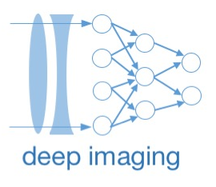

---
# Feel free to add content and custom Front Matter to this file.
# To modify the layout, see https://jekyllrb.com/docs/themes/#overriding-theme-defaults

layout: home

title: Introduction
---

Welcome to Machine Learning and Imaging, BME 590! This class is an overview of machine learning and imaging science, with a focus on the intersection of the two fields. This class is for you if 1) you would with imaging systems (cameras, microscopes, MRI/CT, ultrasound, etc.) and you would like to learn more about machine learning, 2) if you are familiar with machine learning and would like to know more about how your data is gathered, 3) if you work with both imaging systems and machine learning and would like to hear a new perspective on the topic, or 4) if you work with neither imaging systems nor machine learning but have a strong mathematical and signal processing background and are motivated to learn about both.

Detailed syllabus is available [here](./data/syllabus.pdf).

### Learning Goals
By the end of this course, my aim is for you to be comfortable with the following:
1. Understand the core mathematical concepts underlying machine learning
2. Understand the detailed operation of convolutional neural networks
3. Understand how to model and simulate various imaging systems
4. Understand how to merge imaging system models into machine learning frameworks
5. Be able to write your own machine learning code for image data analysis and/or system design

### Course Structure
This class is geared towards Masters and PhD students who want to learn more details about a current topic of active research. It will assume a certain level of background knowledge in math and programming (see pre-requisites below). It will be relatively fast-paced and will skip over some details to reach its primary goal, which is to help each student identify and work on a suitable final project. The final project should be something that you are excited about and could certainly be related to your current research. If you are not currently pursuing a related research topic or any research topic, then that is ok – we can work together to find a suitable final project topic. A very good outcome of this course will be if each student can write machine learning code that they fully understand, that tests something of interest to them (i.e., not just classifying images of cats and dogs), and that includes some hypothesis-driven component to it.

### Pre-requisites
- Linear algebra – vectors, matrices, tensors, dimensional analysis(MATH 221 or equivalent)
- Signal processing – Linear systems, convolutions, Fourier transforms(BME 271 or equivalent)
- Imaging and instrumentation (BME 303 or equivalent)
- Programming – Matlab and basic Python (Numpy, Scipy)
